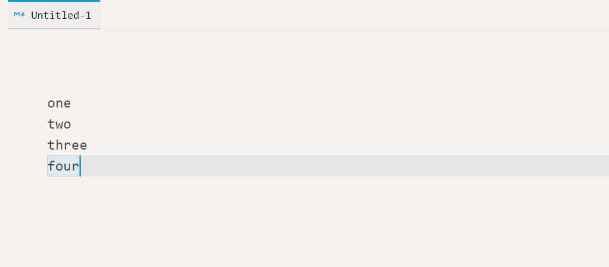
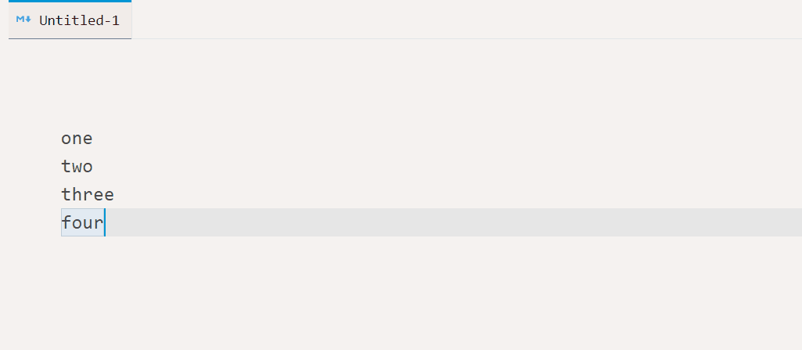
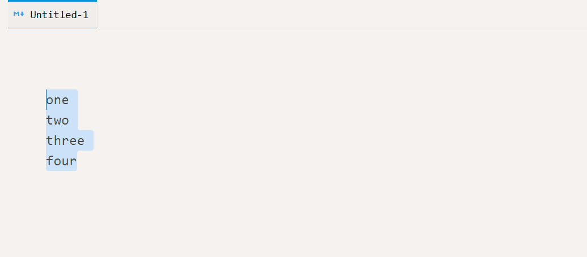

# vscode-join-lines

Join lines by separator specified in settings, keybinding argument or entered by hand.

### Demo



### Demo with settings.json:

```js
"joinLines.defaultSeparator": "__",
```



### Demo with custom entered separator



### From a keybinding

```js
{
	"key": "ctrl+shift+9",
	"command": "joinLines.joinLines",
	"args": {
		"separator": "###"
	}
}
```


<!-- COMMANDS_START -->
## Commands (2)

|Command|Description|
|-|-|
|joinLines.joinLines|Join Lines: Join|
|joinLines.joinLinesWithSeparator|Join Lines: Join With Separator|
<!-- COMMANDS_END -->

<!-- SETTINGS_START -->
## Settings (1)

|Setting|Default|Description|
|-|-|-|
|joinLines.defaultSeparator|"&nbsp;"|Symbol that is used when joining lines|
<!-- SETTINGS_END -->